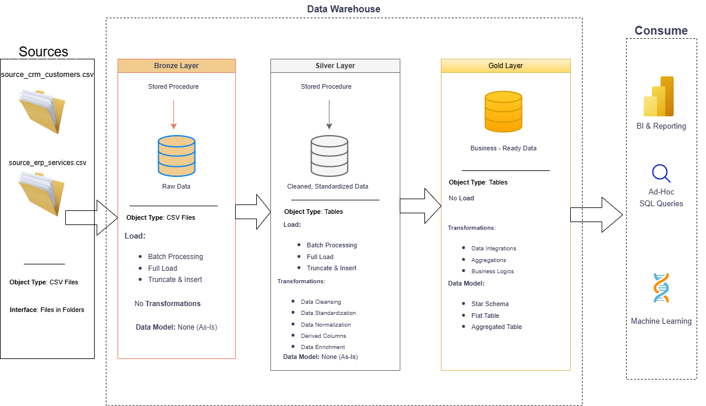

# Telecom Customer Churn Data Warehouse

An end-to-end data warehouse built with SQL Server using the Medallion Architecture (Bronze/Silver/Gold) on telecom customer churn data.

---


## Data Architecture
The project follows the Medallion Architecture with Bronze, Silver, and Gold layers:

1. **Bronze Layer**: Stores raw data as-is from the source systems. Data is ingested from CSV files into SQL Server using BULK INSERT.
2. **Silver Layer**: Includes data cleansing, standardization, and deduplication processes to prepare data for analysis.
3. **Gold Layer**: Houses business-ready data modelled into a star schema optimized for reporting and analytics.

# Project Overview
This project involves:

1. **Data Architecture**: Designing a modern data warehouse using Medallion Architecture (Bronze, Silver, Gold).
2. **ETL Pipelines**: Extracting, transforming, and loading data from two source systems into the warehouse.
3. **Data Modeling**: Developing fact and dimension tables optimized for analytical queries.
4. **Analytics & Reporting**: Building a star schema that enables business analysts to answer key churn questions.


## How to Run

### Prerequisites
- SQL Server 2022
- SSMS
- CSV files placed at `C:\TelecomChurn\Datasets\`

### Steps

**1. Create database and schemas**
```sql
CREATE DATABASE TelecomChurn;
USE TelecomChurn;
CREATE SCHEMA bronze;
CREATE SCHEMA silver;
CREATE SCHEMA gold;
```

**2. Run scripts in this order:**
```
scripts/bronze/ddl_bronze.sql
scripts/bronze/proc_load_bronze.sql  → EXEC bronze.load_bronze;
scripts/silver/ddl_silver.sql
scripts/silver/proc_load_silver.sql  → EXEC silver.load_silver;
scripts/gold/ddl_gold.sql
```
---

## Repository Structure
```
telecom-churn-data-warehouse/
├── datasets/
│   ├── source_crm_customers.csv
│   └── source_erp_services.csv
├── scripts/
│   ├── bronze/
│   │   ├── ddl_bronze.sql
│   │   └── proc_load_bronze.sql
│   ├── silver/
│   │   ├── ddl_silver.sql
│   │   └── proc_load_silver.sql
│   └── gold/
│       └── ddl_gold.sql
└── README.md

## Dashboard

